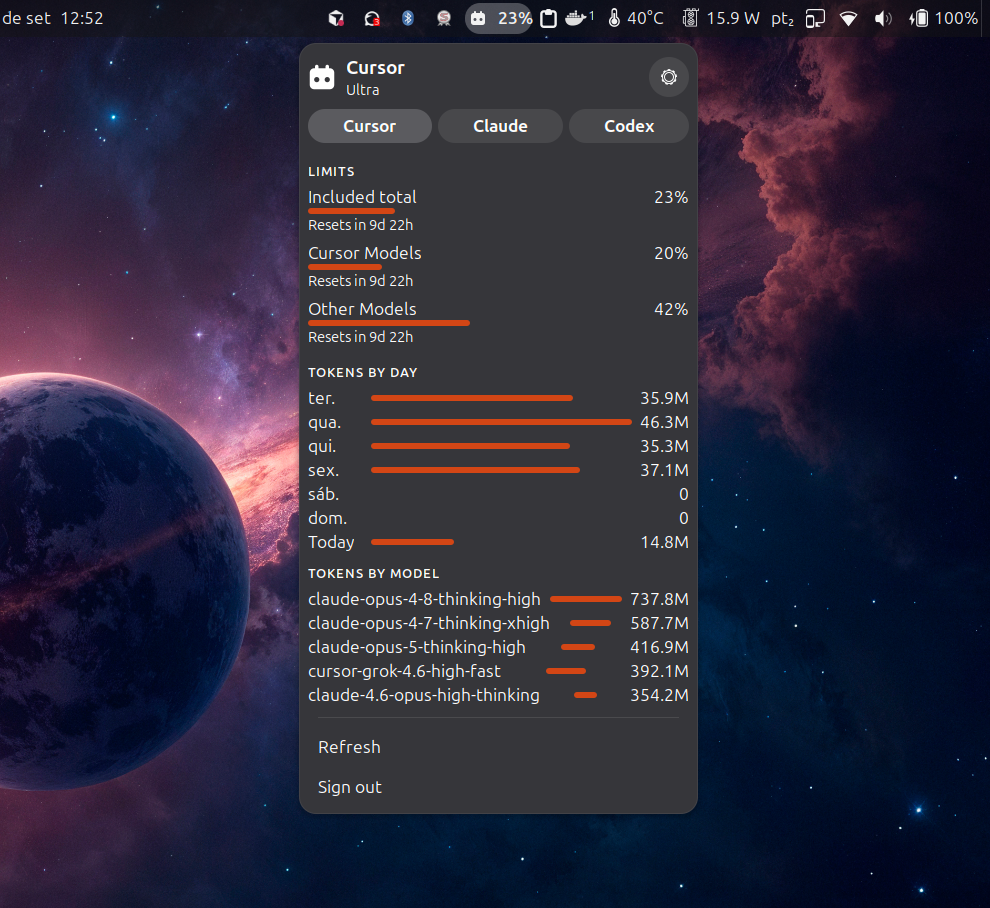
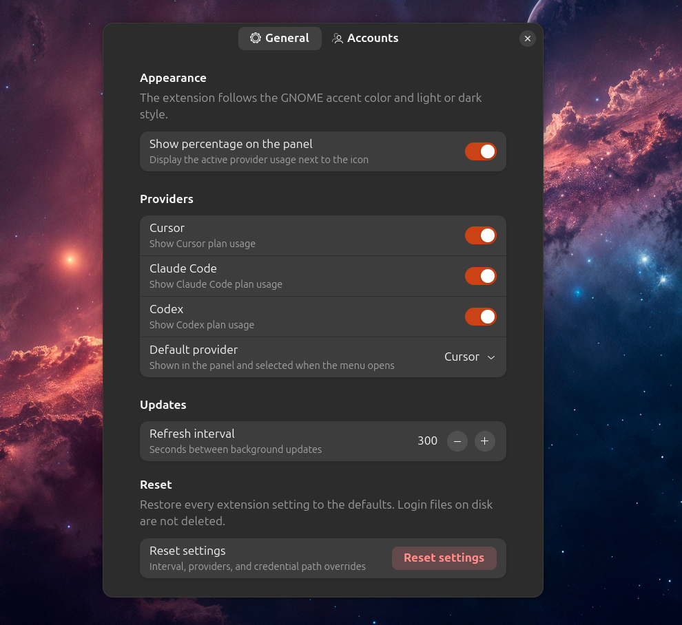
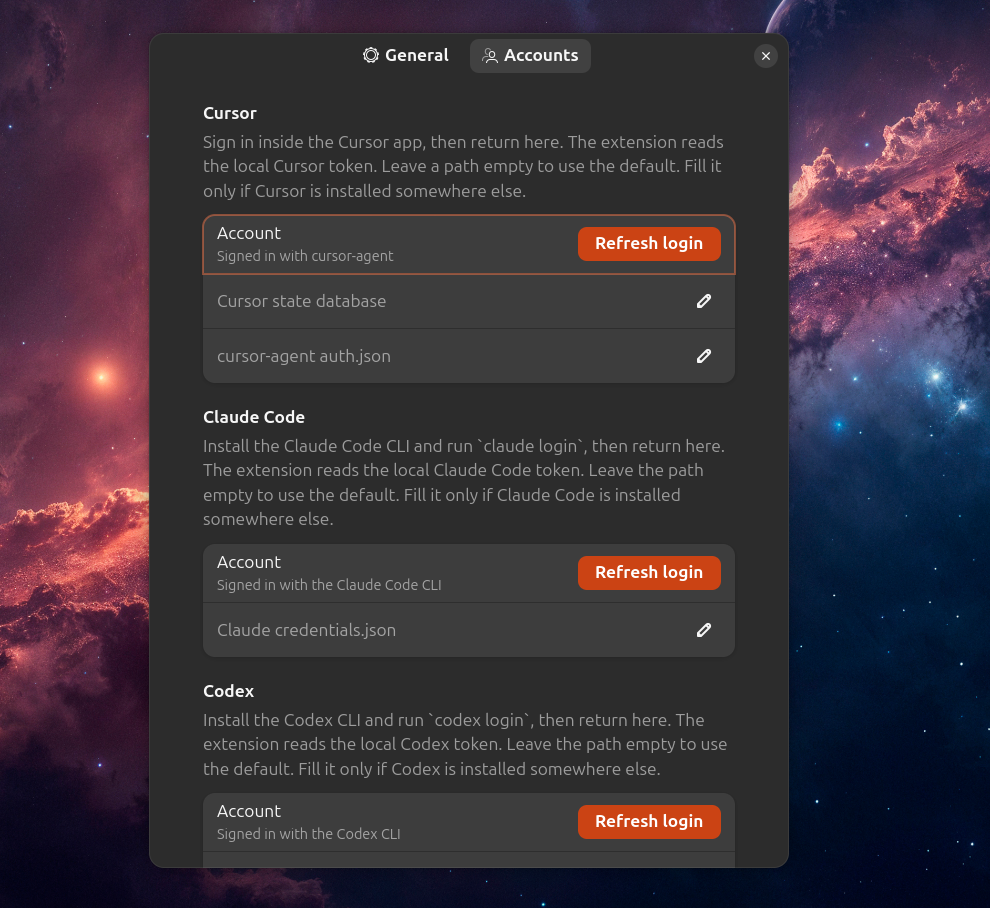

# Gnome Cursor Usage

A GNOME Shell extension that shows **Cursor**, **Claude Code**, and **Codex**
plan usage in the top bar.

It is inspired by
[omarchy-cursor-usage](https://github.com/mrlarsendk/omarchy-cursor-usage), but
it is a native GNOME panel indicator: Adwaita styling, the current GNOME accent
color, and light or dark mode from Settings.

Unofficial extension. It is not affiliated with GNOME, Cursor, Anthropic, or
OpenAI.

## Screenshots







## What you get

- A panel icon in the GNOME status area while the extension is enabled
- Optional usage percentage next to the icon
- A popup with **Cursor**, **Claude**, and **Codex** tabs
- **Cursor:** Included total / Cursor Models / Other Models, tokens by day, and tokens by model
- **Claude Code:** 5-hour, weekly, and optional per-model weekly windows
- **Codex:** 5-hour and weekly quota windows
- Sign in from the popup or from Preferences

The popup uses standard GNOME Shell widgets and theme colors. When you change
the accent color or color scheme in GNOME Settings, the bars and icon follow
those colors.

## Requirements

- GNOME Shell 48, 49, or 50
- `gjs` and `libsoup3`
- `sqlite3` on `PATH` if you want the extension to read a live Cursor IDE session
  from `state.vscdb` (optional when `cursor-agent` is already signed in)
- A local Cursor, Claude Code, and/or Codex sign-in (see Authentication)

## Install

From this repository:

```bash
chmod +x install.sh
./install.sh
```

On Wayland, log out and back in so GNOME Shell loads the new extension, then
enable it:

```bash
gnome-extensions enable gnome-cursor-usage@rhafaelcm.github.io
```

Open preferences with:

```bash
gnome-extensions prefs gnome-cursor-usage@rhafaelcm.github.io
```

To build an installable zip:

```bash
./install.sh pack
gnome-extensions install --force gnome-cursor-usage@rhafaelcm.github.io.shell-extension.zip
```

## Authentication

The extension does **not** register its own OAuth app. It reuses the official
local sign-in that Cursor, Claude Code, and Codex already store on disk, then
calls each vendor's usage endpoint.

### Cursor

Credentials are read in this order:

1. Cursor IDE: `~/.config/Cursor/User/globalStorage/state.vscdb`
   (`cursorAuth/accessToken`)
2. Cursor Agent: `~/.config/cursor/auth.json` (after `cursor-agent login`)

**Sign in** launches `cursor-agent login` when that CLI is installed. That
opens the official Cursor browser flow and writes the token locally. If the CLI
is missing, the extension opens the Cursor app instead so you can sign in there.

### Claude Code

Credentials are read from `~/.claude/.credentials.json` (or
`$CLAUDE_CONFIG_DIR/.credentials.json` when that environment variable is set).

**Sign in** launches `claude login` when the Claude Code CLI is installed.
Expired access tokens are refreshed with the stored refresh token and written
back to the same file. Refresh tokens are single-use, so the file is re-read
before and after a refresh to avoid racing with Claude Code itself.

### Codex

Credentials are read from `~/.codex/auth.json` or `~/.config/codex/auth.json`.

**Sign in** launches `codex login` when the Codex CLI is installed. Expired
access tokens are refreshed with the stored refresh token and written back to
the same file.

The extension never logs tokens. It only talks to Cursor, Anthropic, and
OpenAI/Codex usage endpoints over HTTPS.

## Usage

1. Enable the extension. The icon appears in the top-bar status area.
2. Click the icon.
3. If you are not signed in, choose **Sign in** and finish the browser or app flow.
4. Switch between **Cursor**, **Claude**, and **Codex** with the tabs.
5. Use **Refresh** to update immediately. Background refresh defaults to every 5 minutes.

Claude Code and Codex usage come from the rolling 5-hour and weekly windows.
Those APIs do not provide per-day token charts like Cursor.

## Preferences

- Show or hide the panel percentage
- Enable Cursor, Claude Code, Codex, or any combination
- Default provider for the panel
- Refresh interval
- Optional credential file paths
- Account status and Sign in buttons

## Privacy

- Reads only the local credential files listed above
- Sends those credentials only to the matching vendor usage API
- No telemetry and no third-party analytics
- Sign out runs `cursor-agent logout`, `claude logout`, or `codex logout` when
  available. It does not edit the Cursor IDE database.

## Unofficial APIs

Plan meters use undocumented vendor endpoints:

- Cursor: `https://api2.cursor.sh/aiserver.v1.DashboardService`
- Claude Code: `https://api.anthropic.com/api/oauth/usage`
- Codex: `https://chatgpt.com/backend-api/wham/usage`

Those APIs can change without notice.

## Development

There is no build step. After editing files, copy them again with `./install.sh`
and reload GNOME Shell (log out on Wayland).

Useful checks:

```bash
glib-compile-schemas --strict schemas
journalctl -f -o cat /usr/bin/gnome-shell
```

## License

MIT. See [LICENSE](LICENSE).

GNOME, Cursor, Claude, and Codex names are used only to identify the desktop
and the services whose usage is shown. This project is not affiliated with the
GNOME Foundation, Anysphere, Anthropic, OpenAI, or Omarchy.
